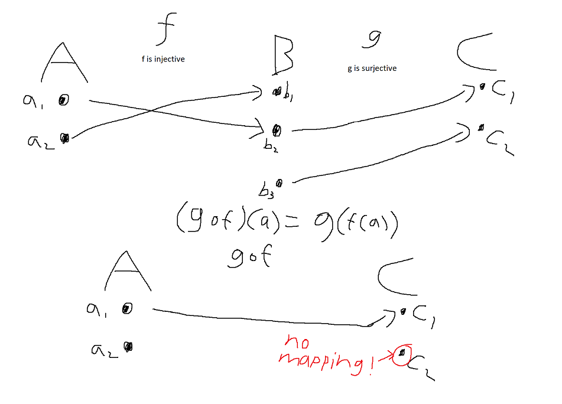

# Homework 13
Prove Props. 9.7(ii,iii), 9.10(ii,iii), 9.11, 9.14, 9.15. Do Project 9.13

## Proposition 9.7

(ii) If $f : A \to B$ is surjective and $g : B \to C$ is surjective then $g \circ f : A \to C$ is surjective.  

**Proof.**  

Let $f : A \to B$ and $g : B \to C$ be surjective functions.  
This implies  
$(\forall b\in B)\text{ } (\exists a \in A) \text{ } f(a)=b$  and $(\forall c\in C)\text{ } (\exists b \in B) \text{ } g(b)=c$  
respectively.  

We need to prove that $g \circ f : A \to C$ is also surjective.  
In other words, we need to prove that  $(\forall c\in C)\text{ } (\exists a \in A) \text{ } g(f(a))=c$  

Let $c\in C$.  
By definition of surjectivity, we know there exists a $b\in B$ for any $c\in C$ where $g(b)=c$.  
Therefore, $f(a)\in B$.  
By definition of surjectivity, we know there exists an $a\in A$ for any $b\in B$ where $f(a)=b$.  
Therefore, $a\in A$.  

We have proved that for all $c\in C$, there exists an $a\in A$ where $g(f(a)) = c$.  

**QED.**  

(iii) If $f : A \to B$ is bijective and $g : B \to C$ is bijective then $g \circ f : A \to C$ is bijective.  

**Proof.**  

Let $f : A \to B$ and $g : B\to C$ be bijective functions. Recall that a function is bijective iff it is both injective and surjective. 

Since $f$ and $g$ are injective, $g\circ f$ is injective by part (i) of this proposition.

Since $f$ and $g$ are surjective, $g\circ f$ is surjective by part (ii) of this proposition.  

Since $g\circ f$ is both injective and surjective, then it is bijective.  

**QED.**  

## Proposition 9.10 (Optional)

(ii) $f$ is surjective if and only if $f$ has a right inverse.  

(iii) $f$ is bijective if and only if $f$ has an inverse.  

## Proposition 9.11

If a function is bijective then it's inverse is unique.  

**Proof.**  

Let $f : A \to B$ be a bijective function.  
By proposition 9.10(iii), an inverse $g$ exists.  
Assume there exists inverses $g_1 : B \to A \text{ and } g_2 : B \to A$, such that $g_1 \neq g_2$.  
<!-- By definition of a two-way inverse, we know $g_1\circ f = \text{id}_A$ and $f\circ g_1 = \text{id}_B$.  
Additionally, $g_2\circ f = \text{id}_A$ and $f\circ g_2 = \text{id}_B$.   -->
Let $b\in B$, and $a\in A\text{ such that } b=f(a)$.  We know $a$ exists, because $f$ is bijective (specifically, surjective).  
By the definition of an inverse, $g_1(b)=g_1(f(a))=a$ and $g_2(f(a))=a$.  

Since $g_1 \text{ and } g_2$ map to the same element $a\in A$ given the same input $b\in B$, $g_1=g_2$.  

**QED.**  

## Proposition 9.14

We want to embed $Z$ into $R$. To do this, we define an injective function $e : Z \to R$ as follows:  

(i) Define $e$ on $Z_{\geq 0}$ recursively: $e(0_Z) := 0_R$ and, assuming $e(n)$ defined for a fixed $n \in Z_{\geq 0}$, define  
$e(n + 1_Z) := e(n) + 1_R$.  

(ii) If $k \in Z$ and $k < 0$, define $e(k) := -e(-k)$.  

**Prove:**  
(i) $e(1_Z) = 1_R$  
(ii) $e(-1_Z) = -1_R$  

## Proposition 9.15

If $k \in \mathbb{N}$ then $e(k) \in \mathbb{R}_{>0}$  

## Project 9.13

Let $f: A \to B$ and $g: B \to C$. Decide whether each of the following is true or false; in each case prove the statement or give a counterexample.  

(i) If $f$ is injective and $g$ is surjective then $g \circ f$ is surjective.  

**This is false.  Counterexample:**  

(ii) If $g \circ f$ is bijective then $g$ is surjective and $f$ is injective.  

**Proof.**  

Let $f: A\to B$ and $g: B\to C$.  
Let $h: A\to C=g\circ f$, where $h$ is bijective (injective and surjective).  

For any $c\in C$, we know there exists an $a\in A$ where $h(a)=c$, since $h$ is surjective.  
We also know $h(a)=g(f(a))$, where $f(a)\in B$. Since for any $c\in C$ there exists an $f(a)\in B$ where $g(f(a))=c$, we know $g$ is surjective by definition.  